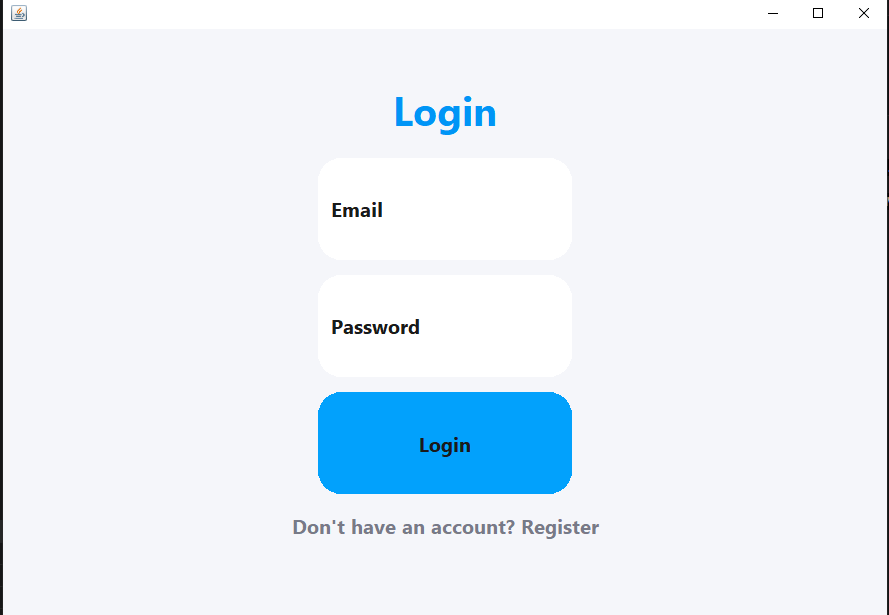
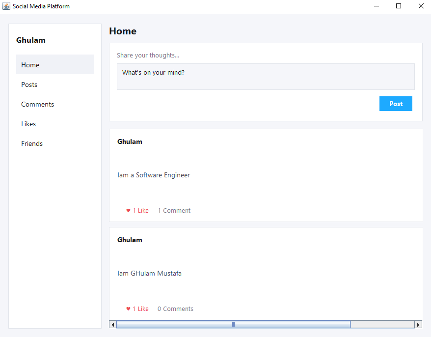
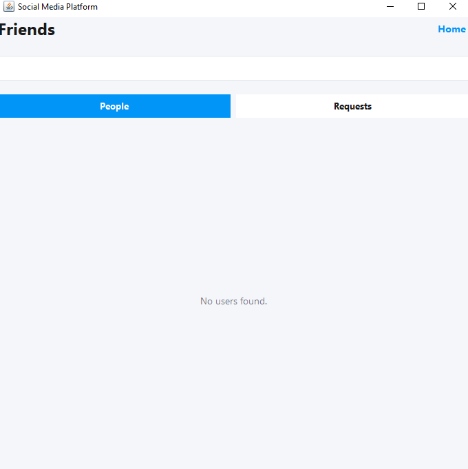

<div align="center">

# 📱 Social Media Platform

### A desktop social media app built with Java Swing & MySQL

[](https://www.oracle.com/java/)
[](https://www.mysql.com/)
[](https://docs.oracle.com/javase/tutorial/uiswing/)
[](#license)

*Register, post, like, comment, and connect with friends — all in a clean, light-themed desktop app.*

</div>

---

## ✨ Features

| Feature | Description |
|---|---|
| 🔐 **Authentication** | Register a new account or log in with an existing one |
| 📰 **News Feed** | Create posts and scroll through everyone's updates |
| ❤️ **Likes & Comments** | Like/unlike posts and leave comments |
| 🗂️ **Personalized Views** | Filter the feed to see just *your* posts, liked posts, or commented posts |
| 🤝 **Friends** | Search users, send/accept/reject friend requests |
| 👤 **Profile** | View your stats (posts, likes, friends) and edit your info & password |
| ✏️ **Post Management** | Edit or delete your own posts anytime |

---

## 🛠️ Tech Stack

- **Java (Swing)** — desktop GUI
- **MySQL** — data storage
- **MySQL Connector/J** — JDBC driver (bundled in `mysql-connector-j-9.7.0/`)

---

## 📂 Project Structure

```
.
├── Model/                      # Data classes (User, Post, Comment, etc.)
├── View/                       # Swing GUI screens (Login, Dashboard, Friends, Profile, ...)
├── Controller/                 # Business logic / database operations
└── mysql-connector-j-9.7.0/    # JDBC driver
```

---

## 🚀 Getting Started

### Prerequisites

- **JDK 8+** installed and on your `PATH`
- **MySQL Server** running locally

### 1. Set up the database

```sql
CREATE DATABASE socialmedia;
```

Then create the required tables (`users`, `posts`, `comments`, `likes`, `friends`) matching the columns used in the `Model` / `Controller` classes.

> By default the app connects on **port 3309** with user `root` and no password — see `View/Database.java` if your setup differs.

### 2. Compile

**Windows**
```bash
javac -encoding UTF-8 -cp "mysql-connector-j-9.7.0\mysql-connector-j-9.7.0.jar" -d out Model\*.java View\*.java Controller\*.java
```

**macOS / Linux**
```bash
javac -encoding UTF-8 -cp "mysql-connector-j-9.7.0/mysql-connector-j-9.7.0.jar" -d out Model/*.java View/*.java Controller/*.java
```

### 3. Run

**Windows**
```bash
java -cp "out;mysql-connector-j-9.7.0\mysql-connector-j-9.7.0.jar" View.Main
```

**macOS / Linux**
```bash
java -cp "out:mysql-connector-j-9.7.0/mysql-connector-j-9.7.0.jar" View.Main
```

The Login window opens on launch — register a new account or log in to reach the dashboard.

---

## 🖼️ Screenshots

**Login**



**Dashboard**



**Friends**



---

## 🗺️ Roadmap

- [ ] Dedicated `username` field separate from first/last name
- [ ] Profile pictures
- [ ] Direct messaging between friends

---

## 📄 License

This project is for educational purposes.

---

<div align="center">

Made by **[Ghulam Mustafa](https://github.com/GhulamMustafa934)**

</div>
